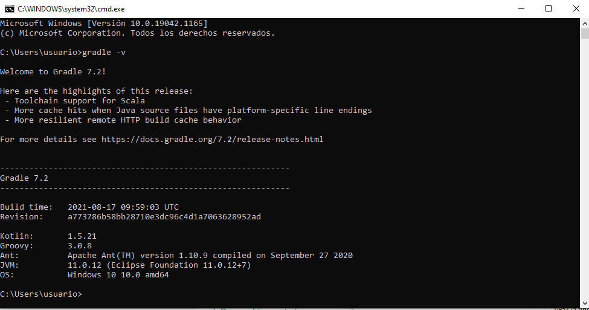
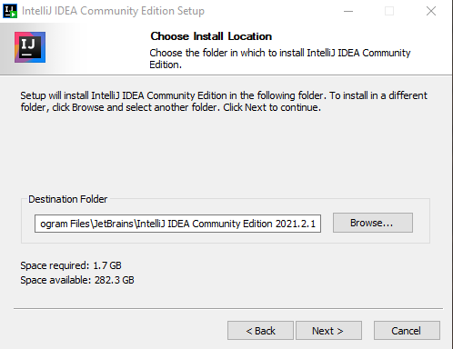
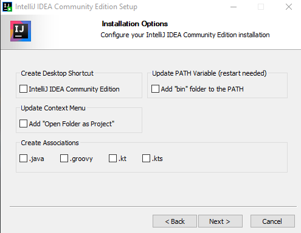
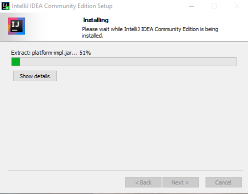
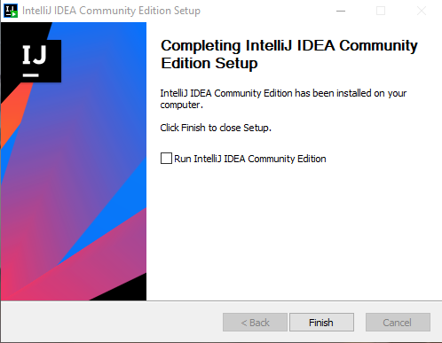
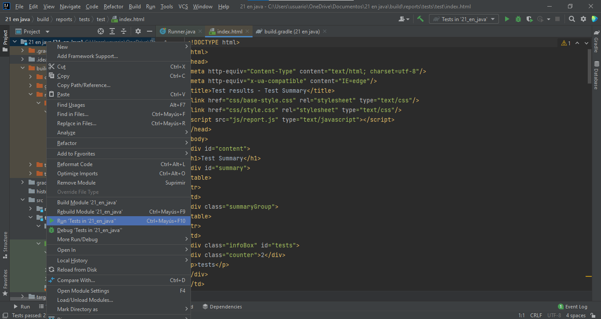
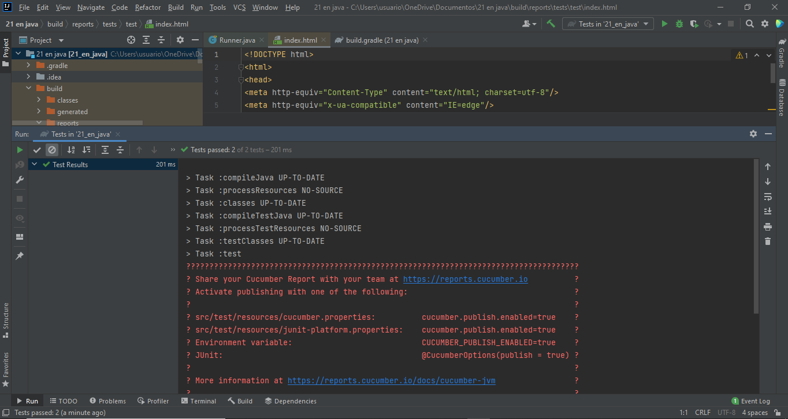
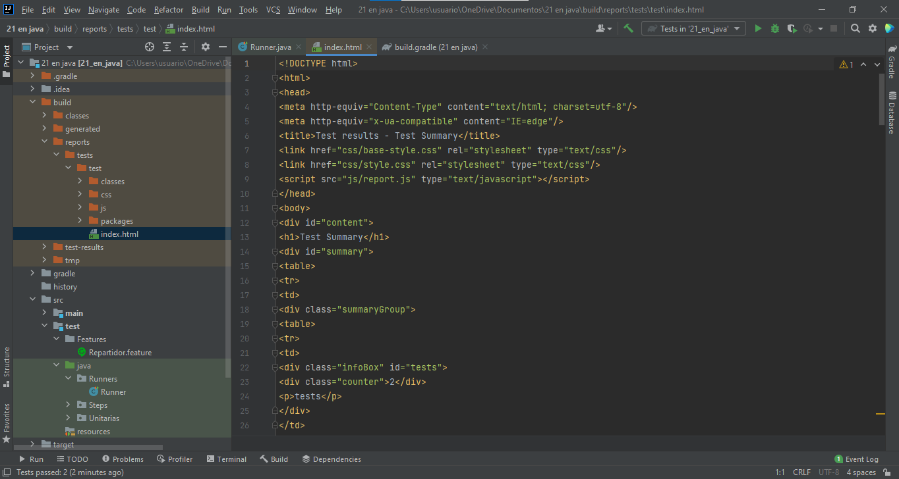
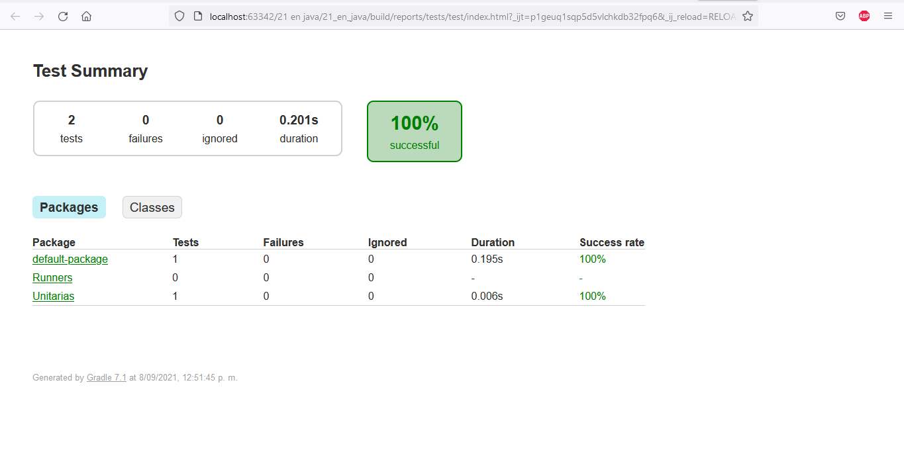

<!-- vscode-markdown-toc -->

# **PRUEBAS UNITARIAS Y DE ACEPTACION  EN JAVA**
## <a name='Integrantes:'></a>**Integrantes :**
* ### **Kevin Duvan Bernal Ortiz - 20181020066**
* ### **Jonathan Steven Cruz Monroy - 20181020064**
* ### **Johan Andres Aguirre Diaz - 20181020072**

<!-- vscode-markdown-toc-config
	numbering=true
	autoSave=true
	/vscode-markdown-toc-config -->
<!-- /vscode-markdown-toc -->

##  <a name='Contenido'></a>**Contenido**
1. [**Objetivo :**](#Objetivo:)
2. [**Herramientas:**](#Herramientas:)
3. [**Instalacion :**](#Instalacion:)
    * 3.1. [**Descarga de Gradle  e IntelliJ IDEA**](#DescargadeGradleeIntelliJIDEA)
    *  3.2. [**Instalacion Gradel**](#InstalacionGradel)
    * 3.3. [**Instalando IntelliJ IDEA**](#InstalandoIntelliJIDEA)
    * 3.4. [**Instalacion Cucumber y Junit**](#InstalacionCucumberyJunit)
4. [**Pruebas :**](#Pruebas:)
5. [**Bibliografia :**](#Bibliografia:)

##  1. <a name='Objetivo:'></a>**Objetivo :**
* ####  Conocer como se pueden realizar este tipo de pruebas en el Lenguaje Java usando las herramientas **Cucumber** , **Junit** y **Gradle** implementando el entorno de desarrollo **IntelliJ IDEA** 

##  2. <a name='Herramientas:'></a>**Herramientas:**

* #### **Cucumber :** Cucumber es una herramienta para implementar metodologías como el Behaviour Driven Development (BDD) o desarrollo basado en comportamiento, que permite ejecutar descripciones funcionales en texto plano como pruebas de software automatizadas.Estas descripciones funcionales se escriben en un lenguaje específico de dominio, legible por el área de negocio, denominado Gherkin. 

<br>

* #### **Junit :** JUnit se trata de un Framework Open Source para la automatización de las pruebas (tanto unitarias, como de integración) en los proyectos Software. El framework provee al usuario de herramientas, clases y métodos que le facilitan la tarea de realizar pruebas en su sistema y así asegurar su consistencia y funcionalidad. 

<br>

* #### **Gradle :** Gradle, es una herramienta que permite la automatización de compilación de código abierto, la cual se encuentra centrada en la flexibilidad y el rendimiento. Los scripts de compilación de Gradle se escriben utilizando Groovy o Kotlin DSL (Domain Specific Language). 

<br>

* #### **IntelliJ IDEA :** IntelliJ IDEA es un Entorno de Desarrollo Integrado (IDE) creado por JetBrains. Está construido en Java y proporciona una experiencia consistente en Windows, macOS y Linux para muchos lenguajes diferentes. Si se desea profundizar mas puede ir al siguiente link 

<br>

##  3. <a name='Instalacion:'></a>**Instalacion :**

####  <a name='AcontinuaciondescribiremoselprocesodeinstalaciondelasherramientasIntelliJIDEAyGradlequenospermitirancrearelproyectoyrealizarlaspruebasdeseadas'></a>Acontinuacion describiremos el proceso de instalacion de las herramientas  **IntelliJ IDEA** y **Gradle** que nos permitiran crear el proyecto y realizar las pruebas deseadas 

<br>

###  3.1. <a name='DescargadeGradleeIntelliJIDEA'></a>**Descarga de Gradle  e IntelliJ IDEA**
<br>

*   #### Incialmente descargamos la herramienta **Gradle**,    para lo cual  nos diriguimos al siguiente link, donde automaticamente empezara la descarga como podemos ver en la siguente imagen:
    <br>

     
    #### Como podemos ver en la imagen la version que se descargo es la 7.2, esta es la version que nosotros usamos. 
    
<br>

*  #### Posteriormente descargaremos el **IntelliJ IDEA** desde el  siguiente  link.


####  3.1.1. <a name='Dentrodellinktendremos2opcionesdedescargarcomosepuedeverenlasiguienteimagen:'></a>Dentro del link tendremos 2 opciones de descargar, como se puede ver en la siguiente imagen:en:

   <br>   
   
   
####  3.1.2. <a name='NosotroshemosdecididodescargalaversionCommunitycomosepodemosveracontinuacion'></a>Nosotros hemos decidido descarga la version Community como se podemos ver a continuacionion 

   <br> 

   

<br>

###  3.2. <a name='InstalacionGradel'></a>**Instalacion Gradel**

<br>

####  3.2.1. <a name='LuegodehaberdescargadoambasherramientasconfiguraremosinicialmentelaherramientaGradlesiguiendoladocumentaciondelamismaestolopodemosverenlaimagenqueapareceacontinuacion'></a>Luego de haber descargado  ambas herramientas configuraremos inicialmente la herramienta **Gradle** siguiendola documentacion de la misma, esto lo podemos ver en la imagen que aparece  a continuacion

<br>

<div style="text-align:center">


</div>

<br>

####  3.2.2. <a name='Conbaseenloanteriorloprimeroqueserealizofueeldescomprimirelarchivopuntozipquequedoalrealizarladescargaestosehizodentrodeunacarpetaquenosresultocomodademanejarestosepuedeveracontinuacion:'></a>Con base en lo anterior lo primero que se realizo fue el  descomprimir el archivo punto zip que quedo al realizar la descarga, esto se hizo dentro de una carpeta que nos resulto comoda de manejar; esto se puede  ver  a continuacion:

<br>

<div style="text-align:center">


<br>


<br>


</div>


####  3.2.3. <a name='Yadescomprimidoelarchivoyubicadoenunacarpetaqueelegimosrealizamoslaconfiguraciondelasvariablesdeentornoparaqueelsistemareconozcalaherramienta.Estolovamosarealizardelasiguienteforma:'></a>Ya descomprimido el archivo y ubicado en una carpeta que elegimos, realizamos la configuracion de las variables de entorno para que el sistema reconozca la herramienta. Esto lo vamos a realizar de la siguiente forma:

<br>


* #### **1)** Buscamos desde la barra de busqueda la opcion variables  de entorno y hacemos clic sobre ella como se muestra en la siguiente imagen

  

* #### **2)** Luego de dar clic nos aparecera una venta y damos  clic sobre la opcion que dice variables de entorno como se muestra acontinuacion 
  

* #### **3)** Ya en esta  ventana, en la seccion que dice variables del sistema  dimos clic en nuevo para crear la nueva variable, esto se puede ver en la siguiente imagen 
  

* #### **4)** Nos aparece una subventa que nos permitira ingresar el nombre de  la variable y la ruta donde se encuentra. El nombre por defecto que se debe colocoar es GRADLE_HOME  y  la ruta que se agrega corresponde a la ruta donde descomprimimos  la herramienta **Gradle**; luego de llenados estos datos damos aceptar como vemos a continuacion
  

* #### **5)** Luego de ingresada esta nueva variable nos dirigimos a la variable Path dando clic sobre ella, nos aperecera una nueva ventana donde crearemos una nueva ruta la cual va a ser **%GRADLE_HOME%\bin** que hara referencia a la variable antes creada, al terminar de ingresar la ruta, damos en aceptar como se muestra en la imagen
   

* #### **6)** Terminado lo anterior, dimos clic en aceptar en la ventana de variables de entornopara que nos guarde todo lo que hemos hecho, esto podemos se puede visualizar en la siguiente imagen 
    

* #### **7)** Por ultimo abrimos el cmd para verificar si quedo correctamente configurado, para  ello  ejecutamos el gradle -v como se ve acontinuacion
    

<br>

###  3.3. <a name='InstalandoIntelliJIDEA'></a>**Instalando IntelliJ IDEA**

####  3.3.1. <a name='LuegodehaberinstaladolaherramientaGradleinstalamoslaherramientacomosevenenlassiguientesimagenes'></a>Luego de haber instalado la herramienta Gradle instalamos la herramienta como se ven en las siguientes imagenes 










####  3.3.2. <a name='Terminadalainstalacionejecutamoselprogramaparacrearnuestroproyecto.'></a>Terminada la instalacion ejecutamos el programa para crear nuestro proyecto.

###  3.4. <a name='InstalacionCucumberyJunit'></a>**Instalacion Cucumber y Junit**
<br>

####  3.4.1. <a name='Luegodecreadonuestroproyectodentrodelarchivobuild.gradleagregamoslasiguienteslineasdecodigo'></a>Luego de creado nuestro proyecto  dentro del archivo **build.gradle** agregamos la siguientes lineas de codigo 

```
dependencies {
    testImplementation 'io.cucumber:cucumber-java:6.10.4'
    testImplementation 'io.cucumber:cucumber-junit:6.10.4'
    testImplementation 'junit:junit:4.12'
}
```
####  3.4.2. <a name='EstasnospermitenelinstalarelCucumberyelJunitparapoderrealizarnuestraspruebas'></a>Estas nos permiten el instalar el Cucumber y el Junit para poder realizar nuestras pruebas 

## 4. <a name='Pruebas:'></a>**Pruebas :**
<br>

####  4.1.1. <a name='Luegodeinstaladoycreadoelproyectoejecutamoslostestquecolocamosdentrodelproyectocomopodemosverenlasiguientesimagenes'></a>Luego de instalado y creado el proyecto  ejecutamos los test que colocamos dentro del proyecto, como podemos ver en la siguientes imagenes





<br>

####  4.1.2. <a name='Losresultadosdelostestloslosencentramosdentrodelacarpetabuildreportestosepuedevisualizaracontinuacion'></a>Los resultados de los test los los encentramos   dentro de la carpeta build/report, esto se puede visualizar a continuacion

<br>



<br>

####  4.2. <a name='Dentrodeestascarpetashayunarchivollamadoindex.htmlendondeseencuentralosresultadosdelaspruebasejecutadasanteriormente.Estolopodemosverenlasiguienteimagen'></a>Dentro de estas carpetas hay un archivo llamado index.html en donde se encuentra los resultados de las pruebas ejecutadas anteriormente. Esto lo podemos ver en la siguiente imagen
<br>



####   <a name='Deestaformapodemosvernuestrotestenfuncionamientoincluyendolasherramientasimplemtadasparalarealizaciondeesteproyecto'></a>De esta forma podemos ver nuestro test en funcionamiento incluyendo las herramientas implemtadas para la realizacion de este proyecto 

<br>

##  5. <a name='Bibliografia:'></a>**Bibliografia :**

- #### https://docs.gradle.org/current/userguide/installation.html

- #### https://cucumber.io/docs/tools/java/

- #### https://cucumber.io/docs/installation/java/

- #### https://gradle.org/next-steps/?version=7.2&format=all

- #### https://www.codecademy.com/articles/kotlin-getting-started-with-intellij

- #### https://openwebinars.net/blog/que-es-gradle/

- #### http://www.juntadeandalucia.es/servicios/madeja/contenido/recurso/248

- #### https://www.pragma.com.co/blog/junit-vs.-cucumber-herramientas-de-automatizacion-de-pruebas

- #### https://www.jetbrains.com/idea/download/#section=windows

