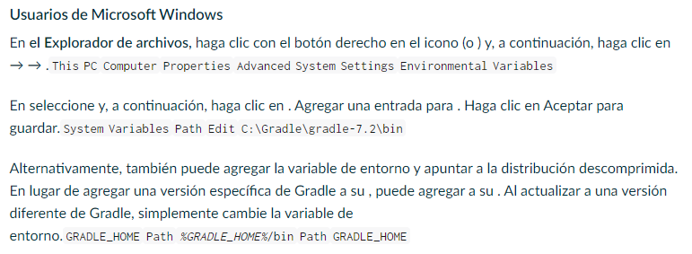
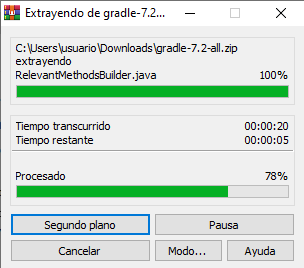
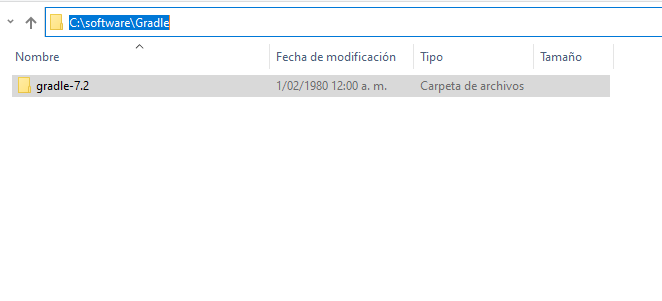
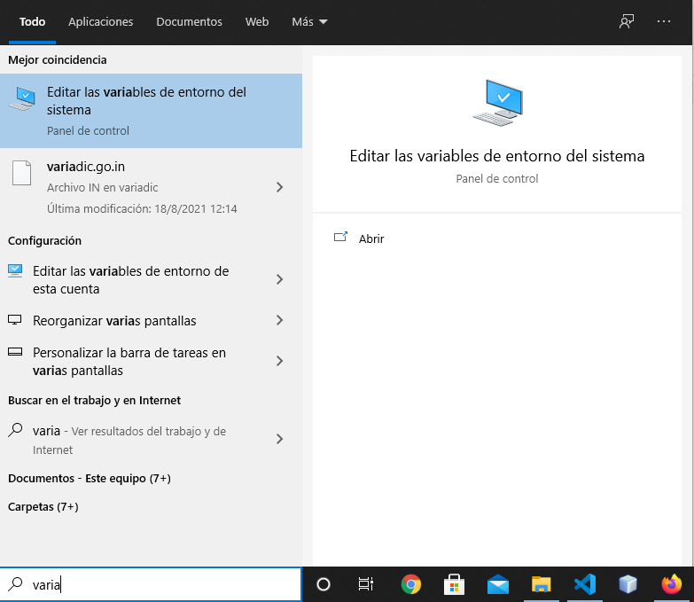
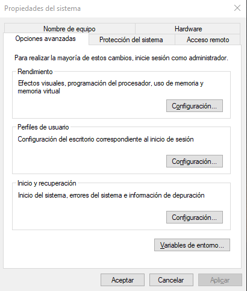
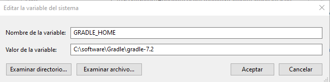
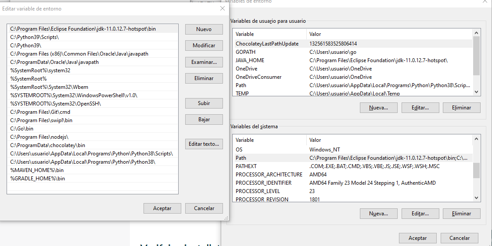
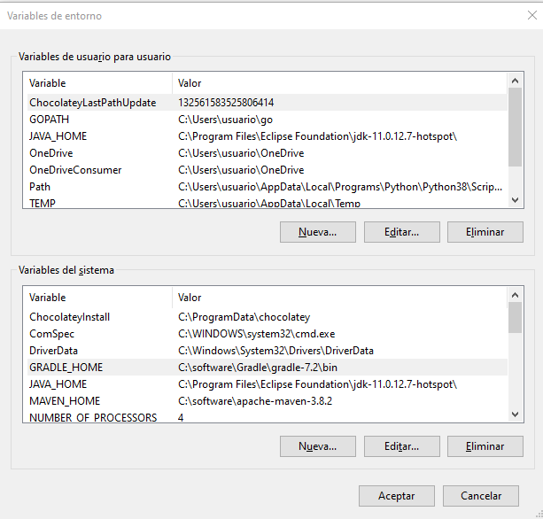

# **PRUEBAS UNITARIAS Y DE ACEPTACION  EN JAVA**
## **Integrantes :**
* ### **Kevin**
* ### **Jonathan**
* ### **Johan**

### **Contenido**

### **Objetivo :**
* ####  Conocer como se pueden realizar este tipo de pruebas en el Lenguaje Java usando las herramientas **Cucumber** , **Junit** y **Gradle** implementando el entorno de desarrollo **IntelliJ IDEA** 

### **Herramientas:**

 

* #### **Cucumber :** Cucumber es una herramienta para implementar metodologías como el Behaviour Driven Development (BDD) o desarrollo basado en comportamiento, que permite ejecutar descripciones funcionales en texto plano como pruebas de software automatizadas.Estas descripciones funcionales se escriben en un lenguaje específico de dominio, legible por el área de negocio, denominado Gherkin. Si se desea profundizar mas puede ir al siguiente link 

 

* #### **Junit :** JUnit se trata de un Framework Open Source para la automatización de las pruebas (tanto unitarias, como de integración) en los proyectos Software. El framework provee al usuario de herramientas, clases y métodos que le facilitan la tarea de realizar pruebas en su sistema y así asegurar su consistencia y funcionalidad. Si se desea profundizar mas puede ir al siguiente link 

 

* #### **Gradle :** Gradle, es una herramienta que permite la automatización de compilación de código abierto, la cual se encuentra centrada en la flexibilidad y el rendimiento. Los scripts de compilación de Gradle se escriben utilizando Groovy o Kotlin DSL (Domain Specific Language). Si se desea profundizar mas puede ir al siguiente link 

 

* #### **IntelliJ IDEA :** IntelliJ IDEA es un Entorno de Desarrollo Integrado (IDE) creado por JetBrains. Está construido en Java y proporciona una experiencia consistente en Windows, macOS y Linux para muchos lenguajes diferentes. Si se desea profundizar mas puede ir al siguiente link 

### **Instalacion :**

#### Acontinuacion describiremos el proceso de instalacion de las herramientas  **IntelliJ IDEA** y **Gradle** que nos permitiran crear el proyecto y realizar las pruebas deseadas 

 

* #### Incialmente descargaremos la herramienta **Gradle**, para lo cual  nos diriguimos al siguiente link, donde automaticamente empezara la descarga como podemos ver en la siguente imagen:
 

*  
     

    #### Como podemos ver en la imagen la version que se descargo es la 7.2 y esa es la que se va usar 
    
 
 

*  #### Posteriormente descargaremos el **IntelliJ IDEA** desde el  siguiente  link.

   #### Dentro del link tendremos 2 opciones de descargar como podemos ver en la siguiente imagen:

       
   
   
   #### Nosotros hemos decidido descarga la version Community como se puede ver en 

     

   

 

#### Luego de haber descargado  ambas herramientas configuraremos inicialmente la herramienta **Gradle** como nos sugiere la documentacion de la misma, esto lo podemos ver en la imagen que aparece  a continuacion

 

 

#### Con base en lo anterior el primer paso es descomprimir el archivo punto zip que quedo al realizar la descarga, esto lo haremos en el alguna carpeta que nos resulte comoda de manejar como se muestra acontinuacion:

 

 

 

 

#### Ya descomprimido el archivo y ubicado en una carpeta de nuestra eleccion, vamos a configurar las variables de entorno para que el sistema reconozca la herramienta. Esto lo vamos a realizar de la siguiente forma:

 

 

### **Pruebas :**

### **Conclusiones**

### **Bibliografia :**

- #### https://docs.gradle.org/current/userguide/installation.html

- #### https://cucumber.io/docs/tools/java/

- #### https://cucumber.io/docs/installation/java/

- #### https://gradle.org/next-steps/?version=7.2&format=all

- #### https://www.codecademy.com/articles/kotlin-getting-started-with-intellij

- #### https://openwebinars.net/blog/que-es-gradle/

- #### http://www.juntadeandalucia.es/servicios/madeja/contenido/recurso/248

- #### https://www.pragma.com.co/blog/junit-vs.-cucumber-herramientas-de-automatizacion-de-pruebas

- #### https://www.jetbrains.com/idea/download/#section=windows